# Scholar-Finder UML Diagrams

## Table of Contents

1. [ER Diagram](#er-diagram)
2. [Class Diagram](#class-diagram)
3. [Use Case Diagram](#use-case-diagram)

---

## ER Diagram

## Entity Descriptions

| Entity               | Schema       | Description                                  |
| -------------------- | ------------ | -------------------------------------------- |
| AUTH_USERS           | auth         | Core authentication data for all users       |
| AUTH_REFRESH_TOKENS  | auth         | JWT refresh tokens for session management    |
| STUDENT_PROFILES     | users        | Detailed student information and preferences |
| INSTITUTION_PROFILES | users        | Institution/university details               |
| ADMIN_PROFILES       | users        | Administrator profiles and permissions       |
| SCHOLARSHIPS         | scholarships | Scholarship listings and details             |
| APPLICATIONS         | scholarships | Student applications to scholarships         |
| SAVED_SCHOLARSHIPS   | scholarships | Bookmarked scholarships by students          |

## Relationship Summary

1. **AUTH_USERS → REFRESH_TOKENS**: One-to-Many (User can have multiple refresh tokens)
2. **AUTH_USERS → STUDENT_PROFILES**: One-to-One (Each student has one profile)
3. **AUTH_USERS → INSTITUTION_PROFILES**: One-to-One (Each institution has one profile)
4. **AUTH_USERS → ADMIN_PROFILES**: One-to-One (Each admin has one profile)
5. **INSTITUTION_PROFILES → SCHOLARSHIPS**: One-to-Many (Institution can post many scholarships)
6. **SCHOLARSHIPS → APPLICATIONS**: One-to-Many (Scholarship can have many applications)
7. **STUDENT_PROFILES → APPLICATIONS**: One-to-Many (Student can apply to many scholarships)
8. **STUDENT_PROFILES → SAVED_SCHOLARSHIPS**: One-to-Many (Student can save many scholarships)

---

## Class Diagram

---

## Use Case Diagram

```mermaid
flowchart TB
    subgraph Actors
        Student((👨‍🎓 Student))
        Institution((🏛️ Institution))
        Admin((👔 Admin))
        Guest((👤 Guest))
    end
    
    subgraph Authentication["🔐 Authentication"]
        UC1[Register Account]
        UC2[Login]
        UC3[Logout]
        UC4[Reset Password]
        UC5[Verify Email]
        UC6[Refresh Token]
    end
    
    subgraph StudentFeatures["📚 Student Features"]
        UC10[Create/Edit Profile]
        UC11[View Scholarships]
        UC12[Search Scholarships]
        UC13[Filter Scholarships]
        UC14[Apply to Scholarship]
        UC15[Track Application Status]
        UC16[Save/Bookmark Scholarship]
        UC17[Get Scholarship Matching]
        UC18[View Application History]
        UC19[Upload Documents]
    end
    
    subgraph InstitutionFeatures["🏛️ Institution Features"]
        UC20[Create Institution Profile]
        UC21[Post Scholarship]
        UC22[Edit Scholarship]
        UC23[Close/Delete Scholarship]
        UC24[View Applications]
        UC25[Review Applications]
        UC26[Shortlist Candidates]
        UC27[Accept/Reject Applications]
        UC28[View Institution Dashboard]
        UC29[Export Application Data]
    end
    
    subgraph AdminFeatures["⚙️ Admin Features"]
        UC30[Manage Users]
        UC31[Verify Institutions]
        UC32[Manage Scholarships]
        UC33[View System Analytics]
        UC34[Moderate Content]
        UC35[Manage Settings]
        UC36[View Admin Dashboard]
        UC37[Suspend/Activate Accounts]
        UC38[Review Reports]
    end
    
    subgraph PublicFeatures["🌐 Public Features"]
        UC40[Browse Scholarships]
        UC41[View Scholarship Details]
        UC42[Read News/Blog]
        UC43[Contact Support]
        UC44[View Previous Scholars]
    end
    
    %% Guest connections
    Guest --> UC1
    Guest --> UC2
    Guest --> UC40
    Guest --> UC41
    Guest --> UC42
    Guest --> UC43
    Guest --> UC44
    
    %% Student connections
    Student --> UC2
    Student --> UC3
    Student --> UC4
    Student --> UC5
    Student --> UC10
    Student --> UC11
    Student --> UC12
    Student --> UC13
    Student --> UC14
    Student --> UC15
    Student --> UC16
    Student --> UC17
    Student --> UC18
    Student --> UC19
    Student --> UC40
    Student --> UC41
    Student --> UC42
    Student --> UC43
    
    %% Institution connections
    Institution --> UC2
    Institution --> UC3
    Institution --> UC4
    Institution --> UC20
    Institution --> UC21
    Institution --> UC22
    Institution --> UC23
    Institution --> UC24
    Institution --> UC25
    Institution --> UC26
    Institution --> UC27
    Institution --> UC28
    Institution --> UC29
    
    %% Admin connections
    Admin --> UC2
    Admin --> UC3
    Admin --> UC30
    Admin --> UC31
    Admin --> UC32
    Admin --> UC33
    Admin --> UC34
    Admin --> UC35
    Admin --> UC36
    Admin --> UC37
    Admin --> UC38
    
    %% Include relationships
    UC14 -.->|includes| UC19
    UC14 -.->|includes| UC10
    UC25 -.->|includes| UC26
    UC25 -.->|includes| UC27
    
    %% Extend relationships
    UC2 -.->|extends| UC6
    UC11 -.->|extends| UC12
    UC11 -.->|extends| UC13
```

---

## Use Case Descriptions

### Authentication Use Cases

| ID | Use Case | Actor(s) | Description |
|----|----------|----------|-------------|
| UC1 | Register Account | Guest | Create a new account as Student or Institution |
| UC2 | Login | All Users | Authenticate with email and password |
| UC3 | Logout | All Users | End current session |
| UC4 | Reset Password | All Users | Request password reset via email |
| UC5 | Verify Email | Student, Institution | Confirm email address |
| UC6 | Refresh Token | System | Automatically refresh expired JWT tokens |

### Student Use Cases

| ID | Use Case | Description |
|----|----------|-------------|
| UC10 | Create/Edit Profile | Complete academic, financial, and preference information |
| UC11 | View Scholarships | Browse available scholarships |
| UC12 | Search Scholarships | Search by keywords, field, or country |
| UC13 | Filter Scholarships | Filter by type, deadline, eligibility |
| UC14 | Apply to Scholarship | Submit application with documents |
| UC15 | Track Application Status | View current status of all applications |
| UC16 | Save/Bookmark Scholarship | Save scholarships for later |
| UC17 | Get Scholarship Matching | AI-powered scholarship recommendations |
| UC18 | View Application History | See past applications and outcomes |
| UC19 | Upload Documents | Upload certificates, transcripts, etc. |

### Institution Use Cases

| ID | Use Case | Description |
|----|----------|-------------|
| UC20 | Create Institution Profile | Set up institution details and verification |
| UC21 | Post Scholarship | Create new scholarship listing |
| UC22 | Edit Scholarship | Update scholarship details |
| UC23 | Close/Delete Scholarship | Remove or close scholarship |
| UC24 | View Applications | See all received applications |
| UC25 | Review Applications | Evaluate student applications |
| UC26 | Shortlist Candidates | Mark promising candidates |
| UC27 | Accept/Reject Applications | Make final decisions |
| UC28 | View Institution Dashboard | Analytics and overview |
| UC29 | Export Application Data | Download application reports |

### Admin Use Cases

| ID | Use Case | Description |
|----|----------|-------------|
| UC30 | Manage Users | CRUD operations on user accounts |
| UC31 | Verify Institutions | Approve/reject institution registrations |
| UC32 | Manage Scholarships | Moderate and manage all scholarships |
| UC33 | View System Analytics | Platform-wide statistics |
| UC34 | Moderate Content | Review and moderate user content |
| UC35 | Manage Settings | Configure system settings |
| UC36 | View Admin Dashboard | Administrative overview |
| UC37 | Suspend/Activate Accounts | Enable/disable user accounts |
| UC38 | Review Reports | Handle user reports and complaints |

---

## How to View These Diagrams

1. **VS Code**: Install "Markdown Preview Mermaid Support" extension, then press `Ctrl+Shift+V`
2. **GitHub/GitLab**: Push to repository - renders automatically
3. **Online**: Copy Mermaid code to [mermaid.live](https://mermaid.live/)
4. **Export**: Use Mermaid CLI: `mmdc -i ER-Diagram.md -o diagram.png`
